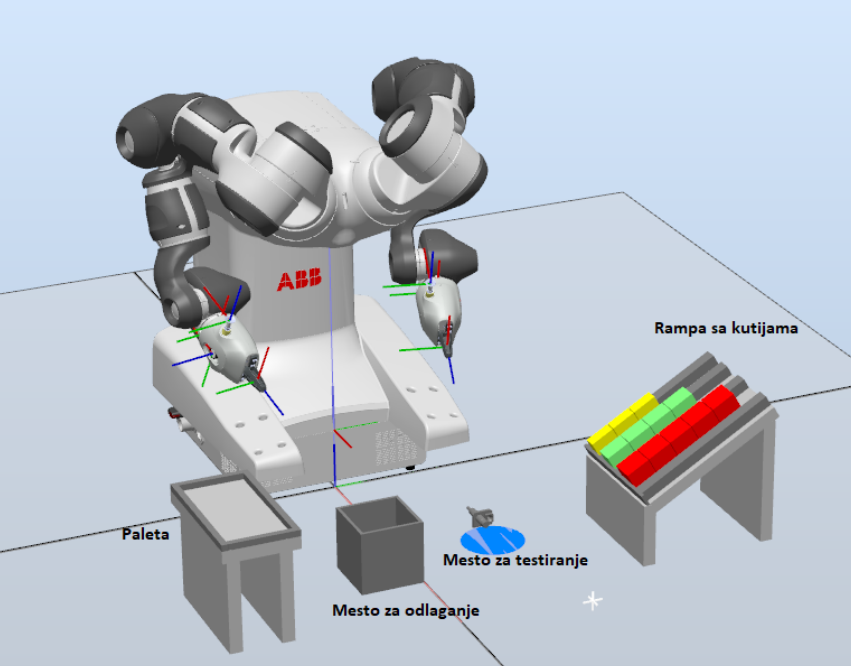

# ABB Robo Challenge 2022
## Project: YuMI Palletizing

This repository contains the code for a hackathon project developed by a team of three,  where the goal was to implement an application in which the YuMI robot performs the palletizing process. The robot is located in a working environment that includes a ramp with boxes that need to be packed on a pallet, as well as three different box sizes. Additionally, there is a pallet on which the corresponding boxes must be arranged, a place to test the boxes for the presence of metal, and a place to store boxes in which metal presence is detected.

   

### Pallet Dimensions
The dimensions of the pallet on which the corresponding boxes should be arranged are (W × D) = (100 × 200mm). 5 boxes of each type are available.

### User Input
The user has the option to choose whether they want to pack one, two or all three types of boxes in the pallet using the Teach Pendant. To realize this functionality it is necessary to use built-in functions TPReadFK, TPReadNum and TPWrite.

### Box Types and Dimensions

| Type of box	Dimensions (H×W×D)| (H×W×D)       |
| -------------                 |:-------------:| 
| 1 - Yellow                    | 40 ×40 × 20mm |
| 2 - Green                     | 40 ×40 × 30mm | 
|  3 - Red                      | 40 ×40 × 40mm | 

### Palletizing Process
The robot must perform the process of palletizing of the selected types of boxes so that the maximum possible number of boxes is packed on the pallet. The maximum allowed height of the pallet is 120mm. On the Teach Pendant, it is necessary to print the number and type of boxes that will be packed on the pallet.

### Metal Detection
Before the box is placed on the pallet, it is necessary to check whether the box taken from the ramp contains metals. Metal testing is done by bringing the box in front of the metal detection sensor. If the box contains metal parts, it is necessary to store the box aside as it is then considered unsuitable. If there are no metals in the box, it is necessary to place the box on the pallet.

### Speed Restrictions
Each robotic arm is equipped with an ABB SmartGripper consisting of a servo gripper and vacuum gripper. The maximum speed at which the robot can move must not be greater than v500, while the speed of the robot for approaching objects that it should be manipulated should be v100 as well as when placing the boxes on the pallet.

### Simulation
It is necessary to make a simulation of the application in the ABB Robot Studio program.

### Additional Features
Before and after the end of palletizing, it is necessary to set the RobotActive digital output signal to a logical low level, as a signal to the operator that he can pick up the packed pallet or to be able to place an empty pallet for a new palletizing cycle.
Also, it is necessary to enable the user to confirm whether the palette is empty and ready for a new palletizing cycle using the Teach Pendant functionality.
